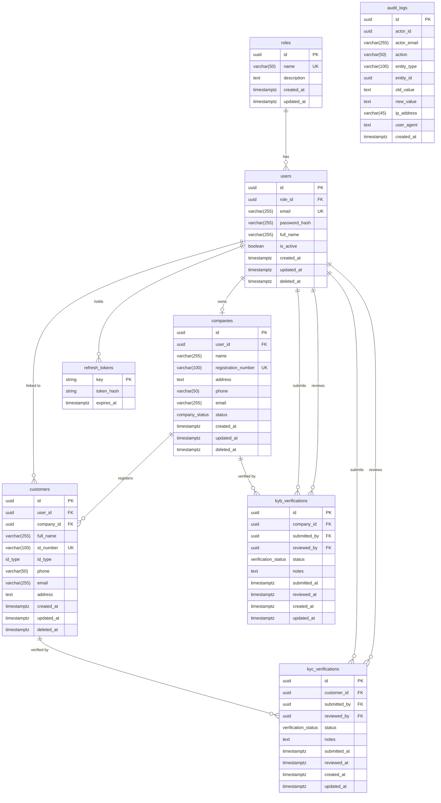

# Entity Relationship Diagram — eKYC Platform

## Diagram

---

## Relationship Descriptions

### `roles` -> `users`  (one-to-many)

Every user is assigned exactly one role. A role may have many users. The
`users.role_id` column is a non-nullable foreign key; a user cannot exist
without a role.

Seeded roles: `admin`, `company`, `customer`.

---

### `users` -> `companies`  (one-to-zero-or-one)

A user with the `company` role owns at most one company. The `companies.user_id`
column is nullable, which allows a company record to exist temporarily without
an owning user account (useful during migrations or bulk imports).

---

### `users` -> `customers`  (one-to-zero-or-many, optional link)

A customer may optionally have a linked user account when they are also a
platform login. The `customers.user_id` column is nullable. This is distinct
from the company-customer relationship below.

---

### `companies` -> `customers`  (one-to-many)

A company registers and manages its customers. Every customer must belong to
exactly one company (`customers.company_id` is NOT NULL). A company may have
zero or many customers.

---

### `customers` -> `kyc_verifications`  (one-to-many)

Each customer may have multiple KYC verification records (one per submission
cycle). At any point in time one record will be in `pending` or will hold the
most-recent `approved` or `rejected` decision. `kyc_verifications.customer_id`
is NOT NULL.

---

### `users` -> `kyc_verifications` via `submitted_by`  (one-to-many)

The user who submitted the KYC verification is recorded in `submitted_by`.
This is typically a company-role user acting on behalf of the customer.
The column is NOT NULL.

---

### `users` -> `kyc_verifications` via `reviewed_by`  (one-to-zero-or-many)

The admin user who reviewed the verification is recorded in `reviewed_by`.
This column is nullable — it is NULL until an admin makes a decision.

---

### `companies` -> `kyb_verifications`  (one-to-many)

Each company may have multiple KYB verification records (one per submission
cycle). `kyb_verifications.company_id` is NOT NULL.

---

### `users` -> `kyb_verifications` via `submitted_by`  (one-to-many)

The user who submitted the KYB verification is recorded in `submitted_by`.
NOT NULL.

---

### `users` -> `kyb_verifications` via `reviewed_by`  (one-to-zero-or-many)

The admin user who reviewed the KYB verification. Nullable until a decision
is made.

---

### `users` -> `refresh_tokens`  (one-to-many, Redis)

Refresh tokens are stored in Redis, not PostgreSQL. Each user may hold multiple
concurrent refresh tokens (one per active session or device). The Redis key
pattern `refresh:{userID}:{tokenID}` scopes every token to its owner, enabling
both per-session and full-user revocation.

---

### `audit_logs` (no direct FK, polymorphic)

`audit_logs` records events against any entity in the system. The
`(entity_type, entity_id)` pair identifies the target record polymorphically
rather than through a foreign key constraint. This allows a single audit table
to cover all entity types without schema changes when new entities are added.

`actor_id` references a user by UUID but carries no FK constraint so that audit
records survive user deletion.

---

## Enum Reference

| Enum name             | Values |
|-----------------------|--------|
| `company_status`      | `pending`, `active`, `inactive` |
| `id_type`             | `ktp`, `passport`, `sim` |
| `verification_status` | `pending`, `approved`, `rejected` |

---

## Soft Delete Tables

The following tables use a nullable `deleted_at` column for logical deletion.
All standard queries filter by `WHERE deleted_at IS NULL`.

| Table       |
|-------------|
| `users`     |
| `companies` |
| `customers` |

`kyc_verifications`, `kyb_verifications`, and `audit_logs` are excluded — they
form an immutable compliance record and must not be hidden or removed.
