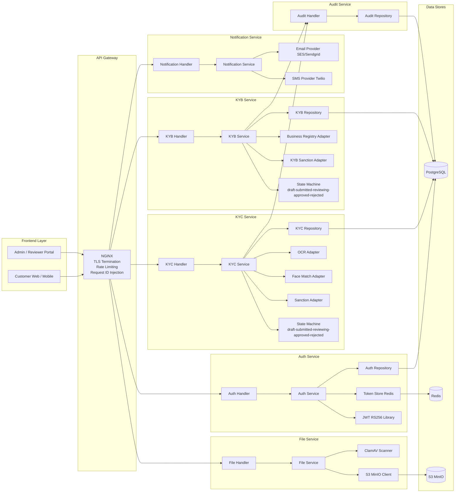
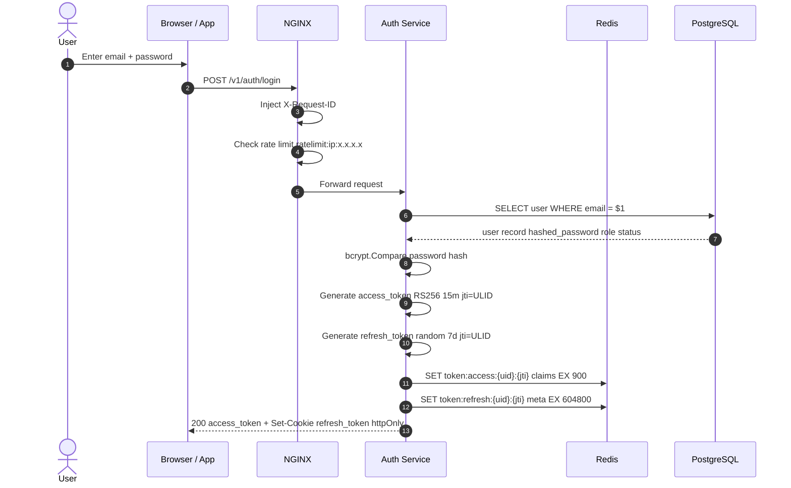
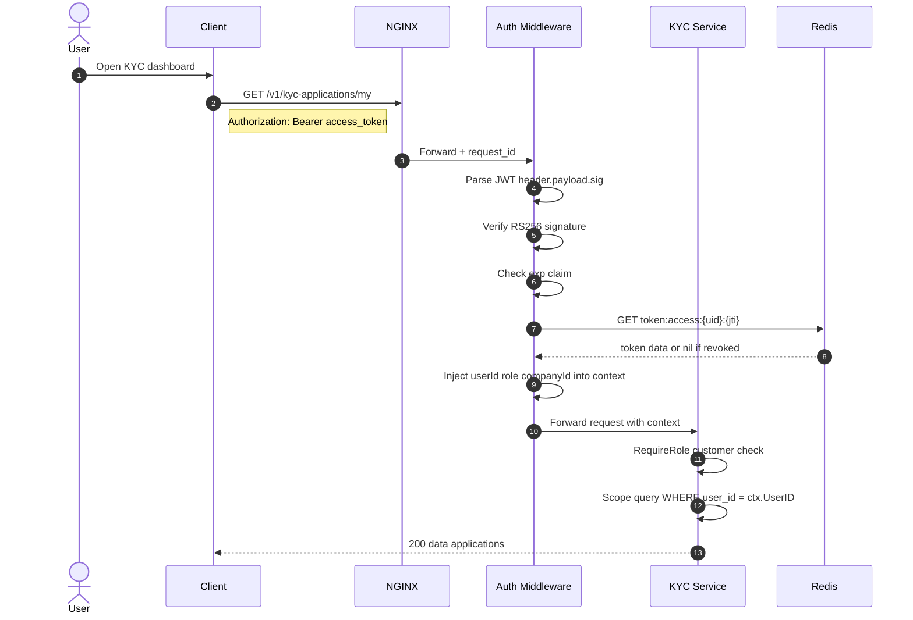
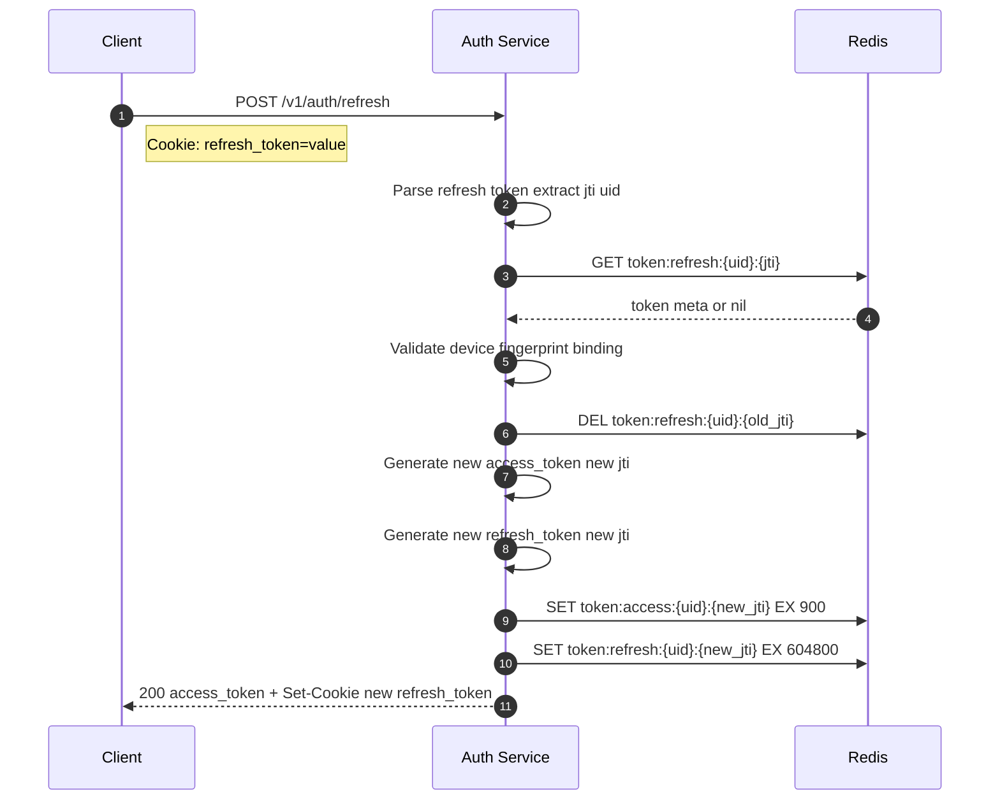
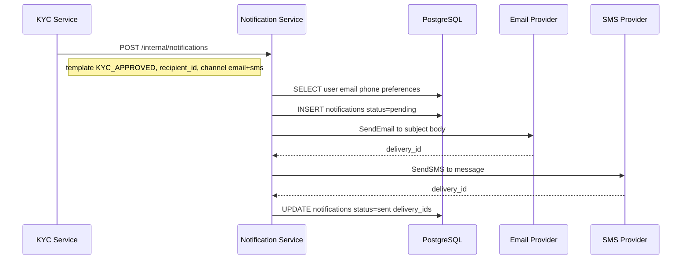

# eKYC & eKYB Platform — System Design

> Companion document to [architecture.md](./architecture.md).
> Architecture covers the what (boundaries, standards, deployment);
> this document covers the how (component internals, data flows, sequences).

---

## 1. Component Diagram



---

## 2. eKYC Verification Data Flow

### 2.1 State Machine

```
draft ─────────────► submitted ─────────────► reviewing
                                                   |
                                             +-----+-----+
                                             |           |
                                        approved      rejected
                                                          |
                                                    (resubmit
                                                    allowed)
                                                          |
                                                     submitted
```

State transitions:

| From      | To        | Trigger                                  | Actor    |
|-----------|-----------|------------------------------------------|----------|
| (new)     | draft     | Customer starts application              | customer |
| draft     | submitted | Customer submits with all documents      | customer |
| submitted | reviewing | Reviewer opens the case                  | reviewer |
| reviewing | approved  | Reviewer approves                        | reviewer |
| reviewing | rejected  | Reviewer rejects with reason             | reviewer |
| rejected  | submitted | Customer resubmits after correction      | customer |

### 2.2 Submission Flow

```
Customer          KYC Service        File Service         OCR          Sanction DB
  |                   |                   |                |                |
  |-- POST /kyc/applications ------------>|               |                |
  |   {personal_data, id_type}            |               |                |
  |                   | create draft      |               |                |
  |                   | INSERT applications (status=draft)|               |
  |<-- 201 {app_id} --|                   |               |                |
  |                   |                   |               |                |
  |-- POST /kyc/applications/{id}/documents ─────────────>|               |
  |   (multipart: id_front, id_back, selfie)              |               |
  |                   |                   | scan virus     |               |
  |                   |                   | validate bytes |               |
  |                   |                   | upload S3      |               |
  |                   |                   |── return URLs ─|               |
  |                   | save doc records  |               |                |
  |<-- 201 doc refs --|                   |               |                |
  |                   |                   |               |                |
  |-- POST /kyc/applications/{id}/submit ─|               |                |
  |                   | validate completeness             |                |
  |                   |── OCR extraction ─────────────────>|               |
  |                   |<── extracted fields (name, dob, id_no) ─────────── |
  |                   | compare extracted vs submitted    |                |
  |                   |── sanction check ─────────────────|────────────────>
  |                   |<── result (clear / match) ─────────────────────────|
  |                   | UPDATE status=submitted           |                |
  |                   | emit AuditEvent                   |                |
  |                   | trigger NotificationEvent         |                |
  |<-- 200 {status: submitted} ────────── |                |               |
```

### 2.3 Review Flow

```
Reviewer            KYC Service          Redis             Audit Service
  |                     |                   |                    |
  |── GET /kyc/applications/{id} (reviewer token) ──────────────|
  |                     |── GET cache:kyc:{id} ─────────────────>|
  |                     | (cache miss)      |                    |
  |                     |── SELECT from kyc_applications ──────  |
  |                     |── SET cache:kyc:{id} TTL 5m ──────────>|
  |                     |── SET lock:kyc:{id} 30s reviewer_id ──>|
  |<── 200 {application details} ─────────────────────────────── |
  |                     |                   |                    |
  |   [reviewer reviews; may request more documents]             |
  |                     |                   |                    |
  |── PATCH /kyc/applications/{id}/approve  |                    |
  |   OR /reject {reason}                   |                    |
  |                     |── check lock owner ──────────────────> |
  |                     | UPDATE status=approved/rejected        |
  |                     |── DEL cache:kyc:{id} ─────────────────>|
  |                     |── DEL lock:kyc:{id} ──────────────────>|
  |                     |── INSERT audit_events ─────────────────────────>|
  |                     | trigger NotificationEvent              |
  |<── 200 {status: approved} ──────────── |                    |
```

### 2.4 Notification Events

| Transition           | Recipient | Channel          | Template                                |
|----------------------|-----------|------------------|-----------------------------------------|
| submitted            | customer  | email            | "Your KYC is under review"              |
| reviewing            | customer  | email            | "A reviewer has opened your case"       |
| approved             | customer  | email + SMS      | "Your identity has been verified"       |
| rejected             | customer  | email            | "KYC rejected — reason + resubmit link" |
| submitted (new case) | reviewer  | in-app + email   | "New KYC application requires review"   |

---

## 3. eKYB Verification Data Flow

### 3.1 KYB State Machine

```
draft ──► submitted ──► reviewing ──► approved
                             |
                        due_diligence ──► approved
                             |
                          rejected ──► (resubmit)
```

`due_diligence` is an optional escalation path for complex cases requiring additional checks. Reviewers can escalate from `reviewing` to `due_diligence` before making a final decision.

### 3.2 KYB Submission Flow

```
Company User      KYB Service       File Service    Biz Registry    Sanction DB
  |                   |                  |                |               |
  |── POST /kyb/applications ----------->|                |               |
  |   {company_name, reg_number,         |                |               |
  |    country, entity_type, directors}  |                |               |
  |                   | create draft     |                |               |
  |<── 201 {app_id} --|                  |                |               |
  |                   |                  |                |               |
  |── POST /kyb/applications/{id}/documents ─────────────>|               |
  |   (cert_of_inc, memorandum,          |                |               |
  |    director_ids, bank_statement)     |                |               |
  |                   |                  | scan + upload  |               |
  |                   | save doc refs    |                |               |
  |<── 201 doc refs --|                  |                |               |
  |                   |                  |                |               |
  |── POST /kyb/applications/{id}/submit ─|               |               |
  |                   | validate completeness             |               |
  |                   |── lookup company ─────────────────>|               |
  |                   |<── company data (status, directors) ──────────────|
  |                   | cross-check directors vs submitted|               |
  |                   |── sanction check (company) ───────|───────────────>
  |                   |── sanction check (each director) ─|───────────────>
  |                   |<── results ───────────────────────|───────────────|
  |                   | UPDATE status=submitted           |               |
  |                   | emit AuditEvent + NotificationEvent               |
  |<── 200 {status: submitted} ──────────|               |               |
```

### 3.3 KYB Review Flow

```
Reviewer          KYB Service            Audit Service      Notification
  |                   |                       |                   |
  |── GET /kyb/applications/{id} ------------>|                   |
  |<── 200 {full KYB data, director list} ----|                   |
  |                   |                       |                   |
  |   [review documents, registry cross-check]|                   |
  |                   |                       |                   |
  |── PATCH /kyb/{id}/request-info (optional) |                   |
  |   {requested_fields, reason}              |                   |
  |                   | UPDATE status=info_requested              |
  |                   |──────────────────────── notify ──────────>|
  |<── 200 ┄┄┄┄┄┄┄┄┄┄┄|                       |                   |
  |                   |                       |                   |
  |── PATCH /kyb/{id}/approve                 |                   |
  |   OR /kyb/{id}/reject {reason}            |                   |
  |                   | UPDATE status         |                   |
  |                   |── INSERT audit_events ────────────────────>|
  |                   |──────────────────────── notify ──────────>|
  |<── 200 ┄┄┄┄┄┄┄┄┄┄┄|                       |                   |
```

---

## 4. Auth Sequence Diagram

### 4.1 Full Login Sequence



### 4.2 Protected Request Sequence



### 4.3 Token Refresh Sequence



### 4.4 Logout Sequence

```
Client              Auth Service          Redis
  |                     |                   |
  |── POST /v1/auth/logout ──────────────── |
  |   Bearer {access_token}                 |
  |   Cookie: refresh_token                 |
  |                     | extract uid + jtis|
  |                     |── DEL token:access:{uid}:{jti} ──────────────>|
  |                     |── DEL token:refresh:{uid}:{jti} ─────────────>|
  |                     |── DEL from user:tokens:{uid} set ────────────>|
  |<── 200 (Set-Cookie: refresh_token=; Max-Age=0)
```

---

## 5. Cache Invalidation Strategy

### 5.1 Invalidation Triggers

| Cache Key                    | Invalidated When                                     | Method         |
|------------------------------|------------------------------------------------------|----------------|
| `cache:kyc:{applicationId}`  | Status changes, documents added, reviewer notes      | `DEL` on write |
| `cache:kyb:{applicationId}`  | Status changes, director list changes                | `DEL` on write |
| `cache:user:{userId}`        | Profile update, role change, password change         | `DEL` on write |
| `token:access:{uid}:{jti}`   | Logout, password change, admin revocation            | `DEL` explicit |
| `token:refresh:{uid}:{jti}`  | Logout, rotation, password change, admin revocation  | `DEL` explicit |

### 5.2 Cache-Aside Read Pattern

```
function getKYCApplication(id):
    cached = redis.GET("cache:kyc:" + id)
    if cached:
        return deserialize(cached)

    record = postgres.query(
        "SELECT * FROM kyc.applications WHERE id = $1", id
    )
    if not record:
        raise NotFoundError

    redis.SET("cache:kyc:" + id, serialize(record), EX=300)
    return record
```

### 5.3 Write-Through Invalidation Pattern

```
function updateKYCStatus(id, newStatus, reviewerId):
    postgres.exec(
        "UPDATE kyc.applications SET status=$1, reviewer_id=$2,
         updated_at=now() WHERE id=$3",
        newStatus, reviewerId, id
    )
    redis.DEL("cache:kyc:" + id)      // immediate DEL — no stale reads
    auditService.record(...)
    notificationService.send(...)
```

### 5.4 Bulk Token Invalidation (User-Level Revocation)

When a user changes password or an admin revokes all sessions, all tokens for that user must be invalidated:

```
// Index: maintain a set of active JTIs per user
redis.SADD("user:tokens:{userId}", jti)
redis.EXPIRE("user:tokens:{userId}", 604800)   // 7-day max lifetime

// On bulk revoke (password change / admin action):
jtis = redis.SMEMBERS("user:tokens:{userId}")
pipeline = redis.pipeline()
for jti in jtis:
    pipeline.DEL("token:access:{userId}:{jti}")
    pipeline.DEL("token:refresh:{userId}:{jti}")
pipeline.DEL("user:tokens:{userId}")
pipeline.execute()   // atomic batch
```

### 5.5 TTL as Consistency Boundary

Even without explicit invalidation, all cache entries carry TTLs providing a natural consistency boundary:

| Key Prefix            | TTL       | Max Stale Reads |
|-----------------------|-----------|-----------------|
| `cache:user:*`        | 10 min    | 10 min          |
| `cache:kyc:*`         | 5 min     | 5 min           |
| `cache:kyb:*`         | 5 min     | 5 min           |
| `token:access:*`      | 15 min    | immediate DEL   |
| `token:refresh:*`     | 7 days    | immediate DEL   |
| `ratelimit:*`         | 1–15 min  | by design       |

---

## 6. Rate Limiting Strategy

### 6.1 Rate Limit Tiers

| Endpoint Category             | Identifier  | Limit     | Window     | Response on Breach         |
|-------------------------------|-------------|-----------|------------|----------------------------|
| `POST /auth/login`            | IP + email  | 10 req    | 15 min     | 429 + `Retry-After` header |
| `POST /auth/refresh`          | IP          | 30 req    | 15 min     | 429                        |
| `POST /kyc-applications`      | user ID     | 3 req     | 24 hours   | 429 (one active app rule)  |
| `POST /kyc/*/documents`       | user ID     | 20 req    | 1 hour     | 429                        |
| `GET /kyc-applications`       | user ID     | 60 req    | 1 min      | 429                        |
| `GET /kyb-applications`       | company ID  | 60 req    | 1 min      | 429                        |
| General API (authenticated)   | user ID     | 300 req   | 1 min      | 429                        |
| General API (unauthenticated) | IP          | 30 req    | 1 min      | 429                        |

### 6.2 Sliding Window Algorithm (Redis + Lua)

```lua
-- KEYS[1] = rate limit key
-- ARGV[1] = limit (integer)
-- ARGV[2] = window_seconds (integer)
local key    = KEYS[1]
local limit  = tonumber(ARGV[1])
local window = tonumber(ARGV[2])
local now    = tonumber(redis.call('TIME')[1])
local min_ts = now - window

-- Remove entries outside the window
redis.call('ZREMRANGEBYSCORE', key, '-inf', min_ts)

-- Count requests in current window
local count = redis.call('ZCARD', key)

if count >= limit then
    return 0  -- rate limited
end

-- Record this request (score = timestamp, member = timestamp + random suffix)
redis.call('ZADD', key, now, now .. '-' .. math.random())
redis.call('EXPIRE', key, window)
return 1  -- allowed
```

### 6.3 Rate Limit Response Headers

```
HTTP/1.1 429 Too Many Requests
X-RateLimit-Limit: 300
X-RateLimit-Remaining: 0
X-RateLimit-Reset: 1749121800
Retry-After: 60
Content-Type: application/json

{
  "success": false,
  "data": null,
  "error": {
    "code": "RATE_LIMITED",
    "message": "Too many requests. Please try again later."
  },
  "meta": {
    "request_id": "req_01J5XQZK3M9VBHF2N7D",
    "timestamp": "2026-06-05T10:00:00Z"
  }
}
```

### 6.4 Graduated Response Strategy

```
80% of limit reached:
  → log WARN event (no client-facing change)

100% of limit reached:
  → return 429 with Retry-After header

Sustained abuse (>5x limit within window):
  → add IP to temporary Redis blocklist (1 hour)
  → return 429 immediately (before Lua window check)

Blocklist threshold reached 3x in 24h:
  → emit alert to on-call (PagerDuty / OpsGenie)
  → require manual review to remove from blocklist
```

### 6.5 NGINX-Level Rate Limiting (First Defense)

NGINX handles coarse-grained IP rate limiting before requests reach the application layer:

```nginx
# nginx.conf excerpt

limit_req_zone $binary_remote_addr zone=api_limit:10m  rate=100r/m;
limit_req_zone $binary_remote_addr zone=auth_limit:10m rate=5r/m;

location /v1/auth/login {
    limit_req zone=auth_limit burst=3 nodelay;
    limit_req_status 429;
    proxy_pass http://auth-service;
}

location /v1/auth/refresh {
    limit_req zone=auth_limit burst=5 nodelay;
    limit_req_status 429;
    proxy_pass http://auth-service;
}

location /v1/ {
    limit_req zone=api_limit burst=20 nodelay;
    limit_req_status 429;
    proxy_pass http://backend;
}
```

Fine-grained per-user / per-company limits are enforced at the service layer via the Redis sliding window Lua script described above.

---

## 7. Database Schema Overview

### 7.1 Core Tables

```sql
-- KYC application (PII fields encrypted with pgcrypto AES-256)
CREATE TABLE kyc.applications (
    id               TEXT        PRIMARY KEY,   -- ULID
    user_id          TEXT        NOT NULL,
    company_id       TEXT,
    status           TEXT        NOT NULL DEFAULT 'draft',
    id_type          TEXT        NOT NULL,      -- KTP, PASSPORT, SIM
    full_name_enc    BYTEA,
    id_number_enc    BYTEA,
    dob_enc          BYTEA,
    address_enc      BYTEA,
    nationality      TEXT,
    reviewer_id      TEXT,
    rejection_reason TEXT,
    ocr_result       JSONB,
    sanction_result  JSONB,
    submitted_at     TIMESTAMPTZ,
    reviewed_at      TIMESTAMPTZ,
    created_at       TIMESTAMPTZ NOT NULL DEFAULT now(),
    updated_at       TIMESTAMPTZ NOT NULL DEFAULT now()
);

CREATE TABLE kyc.documents (
    id               TEXT        PRIMARY KEY,
    application_id   TEXT        NOT NULL REFERENCES kyc.applications(id),
    doc_type         TEXT        NOT NULL,   -- ID_FRONT, ID_BACK, SELFIE, LIVENESS
    s3_key           TEXT        NOT NULL,
    mime_type        TEXT        NOT NULL,
    size_bytes       BIGINT,
    virus_scan_ok    BOOLEAN,
    uploaded_at      TIMESTAMPTZ NOT NULL DEFAULT now()
);

-- KYB application
CREATE TABLE kyb.applications (
    id               TEXT        PRIMARY KEY,
    company_id       TEXT        NOT NULL,
    submitted_by     TEXT        NOT NULL,
    status           TEXT        NOT NULL DEFAULT 'draft',
    entity_type      TEXT        NOT NULL,   -- PT, CV, YAYASAN
    company_name     TEXT        NOT NULL,
    reg_number       TEXT        NOT NULL,
    country          TEXT        NOT NULL,
    reg_status       TEXT,
    registry_data    JSONB,
    sanction_result  JSONB,
    reviewer_id      TEXT,
    rejection_reason TEXT,
    submitted_at     TIMESTAMPTZ,
    reviewed_at      TIMESTAMPTZ,
    created_at       TIMESTAMPTZ NOT NULL DEFAULT now(),
    updated_at       TIMESTAMPTZ NOT NULL DEFAULT now()
);

CREATE TABLE kyb.directors (
    id               TEXT        PRIMARY KEY,
    application_id   TEXT        NOT NULL REFERENCES kyb.applications(id),
    full_name        TEXT        NOT NULL,
    id_number_enc    BYTEA,
    nationality      TEXT,
    role             TEXT,      -- DIRECTOR, COMMISSIONER, SHAREHOLDER
    ownership_pct    NUMERIC(5,2),
    kyc_verified     BOOLEAN    DEFAULT false,
    kyc_app_id       TEXT
);

-- Immutable audit log
CREATE TABLE audit.events (
    id               TEXT        PRIMARY KEY,
    actor_id         TEXT        NOT NULL,
    actor_role       TEXT        NOT NULL,
    action           TEXT        NOT NULL,
    resource_type    TEXT        NOT NULL,
    resource_id      TEXT        NOT NULL,
    before_state     JSONB,
    after_state      JSONB,
    ip_address       TEXT,
    request_id       TEXT        NOT NULL,
    created_at       TIMESTAMPTZ NOT NULL DEFAULT now()
    -- UPDATE and DELETE are forbidden on this table
);
```

### 7.2 Indexes

```sql
CREATE INDEX idx_kyc_apps_user_id    ON kyc.applications(user_id);
CREATE INDEX idx_kyc_apps_status     ON kyc.applications(status);
CREATE INDEX idx_kyc_apps_company    ON kyc.applications(company_id);
CREATE INDEX idx_kyc_apps_reviewer   ON kyc.applications(reviewer_id);
CREATE INDEX idx_kyc_docs_app_id     ON kyc.documents(application_id);

CREATE INDEX idx_kyb_apps_company_id ON kyb.applications(company_id);
CREATE INDEX idx_kyb_apps_status     ON kyb.applications(status);
CREATE INDEX idx_kyb_directors_app   ON kyb.directors(application_id);

CREATE INDEX idx_audit_actor         ON audit.events(actor_id, created_at DESC);
CREATE INDEX idx_audit_resource      ON audit.events(resource_type, resource_id, created_at DESC);
```

---

## 8. External Integration Adapters

### 8.1 Adapter Interface Pattern

Each external provider is wrapped in an adapter implementing a domain interface.
Swapping providers requires only a new adapter — zero changes to service logic.

```go
// OCR interface
type OCRProvider interface {
    ExtractIDDocument(ctx context.Context, imageURL string, idType string) (*OCRResult, error)
}

// Face match and liveness interface
type FaceMatchProvider interface {
    MatchFace(ctx context.Context, faceURL string, documentURL string) (*FaceMatchResult, error)
    CheckLiveness(ctx context.Context, videoURL string) (*LivenessResult, error)
}

// Sanction check interface
type SanctionProvider interface {
    CheckPerson(ctx context.Context, req SanctionPersonRequest) (*SanctionResult, error)
    CheckEntity(ctx context.Context, req SanctionEntityRequest) (*SanctionResult, error)
}

// Business registry interface
type BusinessRegistryProvider interface {
    LookupCompany(ctx context.Context, regNumber string, country string) (*CompanyRecord, error)
}
```

### 8.2 Retry and Circuit Breaker Policy

```
Retry policy (per external call):
  max attempts  : 3
  initial delay : 200ms
  backoff factor: 2x
  max delay     : 2s
  retryable     : HTTP 5xx, network timeout
  non-retryable : HTTP 4xx (bad input — no retry)

Circuit breaker (per provider):
  failure threshold : 5 failures within 30s
  half-open probe   : 1 request per 10s
  open state action : return SERVICE_UNAVAILABLE immediately
```

### 8.3 Timeout Budget Per Provider

| Provider              | Timeout |
|-----------------------|---------|
| OCR extraction        | 10s     |
| Face match / liveness | 15s     |
| Sanction check        | 5s      |
| Business registry     | 8s      |
| File virus scan       | 30s     |

---

## 9. File Upload Flow

```
Client          NGINX          File Service          ClamAV         MinIO / S3
  |               |                  |                  |               |
  |── POST /files/upload ─────────── >|                  |               |
  |  multipart/form-data              |                  |               |
  |  file + {app_id, doc_type}        |                  |               |
  |               |                  | validate MIME type|               |
  |               |                  | validate magic bytes              |
  |               |                  | check size ≤ 10MB|               |
  |               |                  |── scan ──────────>|               |
  |               |                  |<── clean / infected               |
  |               |                  | (infected: 422 + log + alert)    |
  |               |                  |── PUT object ─────|─────────────> |
  |               |                  |   key = {app_id}/{type}/{ulid}   |
  |               |                  |<── 200 ETag ──────|──────────────|
  |               |                  | INSERT files record               |
  |<── 201 {file_id, s3_key} ──────── |                  |               |
```

Pre-signed download URL:

```
Client          File Service          MinIO / S3
  |                  |                    |
  |── GET /files/{id}/download-url ──────>|
  |                  | verify ownership   |
  |                  |── presign(key, 5m) ─>|
  |                  |<── presigned URL ── |
  |<── 200 {url, expires_at} ─────────── |
```

---

## 10. Notification Flow



Failed deliveries retry with exponential backoff (3 attempts, 1s / 2s / 4s). After all retries fail, status is set to `failed` and an alert fires.

---

## 11. Health Check Endpoints

Each service exposes:

```
GET /health/live    -- liveness: service process is running
GET /health/ready   -- readiness: DB and Redis connections are healthy
```

Response:

```json
{
  "status": "ok",
  "service": "kyc-service",
  "version": "1.2.3",
  "checks": {
    "postgres": "ok",
    "redis": "ok"
  },
  "uptime_seconds": 3600
}
```

NGINX and Kubernetes use `/health/ready` for load balancing and rolling deployment decisions.

---

## 12. Observability Summary

| Signal  | Development                  | Production                   |
|---------|------------------------------|------------------------------|
| Logs    | stdout JSON + Docker logs    | Loki / Elasticsearch         |
| Metrics | Prometheus `/metrics`        | Prometheus + Grafana         |
| Traces  | OpenTelemetry (console)      | Jaeger / Tempo               |
| Alerts  | -                            | Grafana Alerting / PagerDuty |

Key metrics per service:

- `http_requests_total{method, path, status}` — counter
- `http_request_duration_seconds{method, path}` — histogram
- `kyc_applications_total{status}` — counter
- `kyb_applications_total{status}` — counter
- `external_provider_calls_total{provider, result}` — counter
- `redis_cache_hit_total{key_prefix}` — counter
- `redis_cache_miss_total{key_prefix}` — counter
